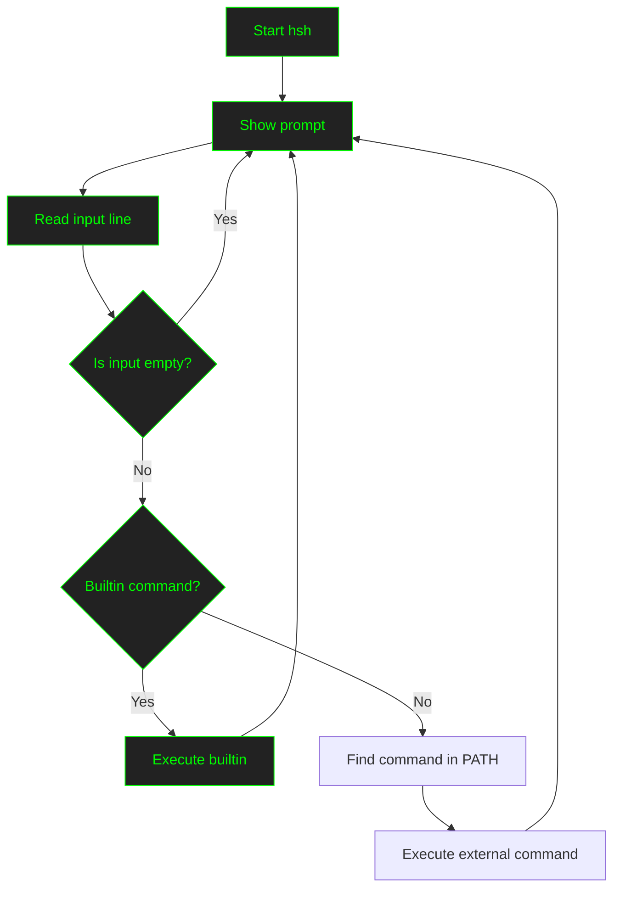

# Simple Shell - hsh

A simple **Unix shell clone** written in C.  
This project implements a basic command-line interpreter capable of executing programs, handling paths, and supporting a few built-in commands.

---

## Features

- Interactive prompt `($)`  
- Executes commands with absolute and relative paths  
- Command search in `$PATH`  
- Implemented builtins:
  - `exit`
  - `env`  
- Basic error handling and exit codes  

---

## Usage

### 🔹 Interactive mode
Run the shell and type commands:

```sh
./hsh
($) ls -l
($) pwd
($) exit

```

###🔹 Non-interactive mode

You can pass a script file as input:

``` sh
echo "ls -l" > script.sh
./hsh script.sh
```

It also works with pipes and redirections:

```sh
echo "echo Hello World" | ./hsh
```

## Project Structure
```
.
├── shell.h
├── main.c
├── prompt.c
├── parser.c
├── path.c
├── builtins.c
├── errors.c
├── man_1_simple_shell
└── README.md
```

## Conceptual Map of the Shell

```
┌──────────────┐
│   main.c     │
│   main()     │
└──────┬───────┘
       │
       ▼
┌───────────────────┐
│   prompt.c        │
│   prompt()        │
└──────┬────────────┘
       │
       ▼
┌────────────────────┐
│ handle_line.c      │
│ handle_line()      │
└──────┬─────────────┘
       │
       ▼
┌──────────────────┐
│   parse.c        │
│ split_line()     │
│ free_tokens()    │
└──────┬───────────┘
       │ args[]
       ▼
┌──────────────────────┐
│ builtins.c           │
│ is_builtin()?        │───► sí ─► builtin_env() / builtin_exit()
└─────────┬────────────┘
          │ no
          ▼
┌───────────────────┐
│  execute.c        │
│ execute_cmd()     │
└───────┬───────────┘
        │
        ▼
┌──────────────────────┐
│   path.c             │
│ find_command_path()  │
│ join_dir_cmd()       │
│ path_lookup_in_env() │
└─────────┬────────────┘
          │
┌─────────▼───────────┐
│ child_exec.c        │
│ child_exec()        │
│ execve()            │
└─────────┬───────────┘
          │
┌─────────▼────────────┐
│ wait_and_get_status  │
│ print_error_not_found│
└──────────────────────┘

```
## Flowchart – How it works



## Examples

```sh
($) /bin/ls
file1  file2  file3
```
```sh
($) ls -l
-rw-r--r-- 1 user user  123 Aug 20 10:00 file1
-rw-r--r-- 1 user user  456 Aug 20 10:05 file2
```

```sh
($) env
PATH=/usr/local/bin:/usr/bin:/bin
HOME=/home/user
...
```

```sh
($) exit
```

## Installation

Clone the repository and compile:

git clone https://github.com/macximiliam/holbertonschool-simple_shell.git

cd simple_shell

gcc -Wall -Werror -Wextra -pedantic *.c -o hsh


### Run:

./hsh

## Documentation

This project includes a manual page.
To view it in your terminal after compiling:

man ./man_1_hsh

## Authors

Selena Gomez

Alexander Zuleta
